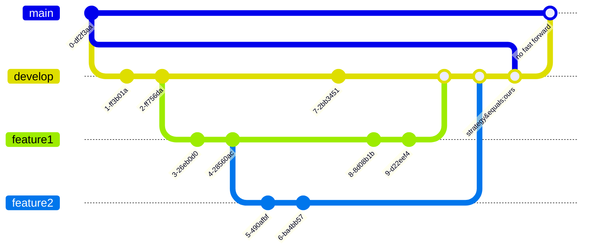

여러분, Git 브랜치 관리는 어떻게 하시나요? 

저희 팀의 경우,` master(main)` 브랜치 대신 `develop` 브랜치에서 시작해 `release` 브랜치로 작업을 해왔는데요. 
최근에 `master(main)` 브랜치를 다시 사용하기로 결정했습니다. 
하지만, 오랫동안 관리되지 않아 병합하는 데 여러 문제가 있었어요. 
고민 끝에, 최신 브랜치로 `master(main)` 브랜치를 간단하게 덮어쓰는 방법을 찾아서 공유드립니다.



## master(main) 브랜치 업데이트 방법

```bash
$ git checkout master
$ git pull
```

먼저 master 브랜치를 원격 저장소와 동기화합니다.

## develop 브랜치에 master(main) 브랜치 반영하기

```bash
$ git checkout develop
$ git merge --strategy=ours master
```

여기서 --strategy=ours 옵션을 사용해 master 브랜치를 develop에 반영합니다. ours 전략은 다른 브랜치의 변경 사항을 무시하고, develop 브랜치의 상태를 유지합니다.

## master(main) 브랜치에 develop 브랜치 반영하기

```bash
$ git checkout master
$ git merge --no-ff develop
```

이제 master 브랜치에 develop 브랜치를 반영합니다. `--no-ff` 옵션은 fast-forward merge 를 하지 않고, merge commit을 생성합니다. 

이 방법을 사용하면 쉽게 `master` 브랜치를 `develop` 브랜치의 내용으로 업데이트할 수 있습니다.

## 참고
- [stackoverflow](https://stackoverflow.com/questions/40517129/git-merge-with-force-overwrite)
